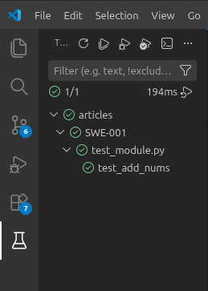
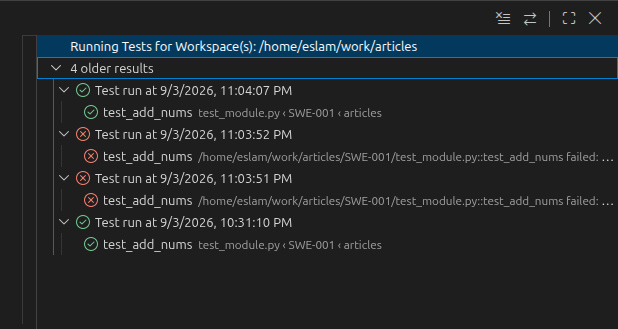

## SWE-001 - Unit Testing and Debugging C Code Using Python + PyTest + GDB

### Problem
A common flow in embedded systems development is unit testing some firmware modules.  
firmware is primarily written in C or C++. 
Let's explore the common ways to do so in the next few sections.

### Solution #1 - The Testbench Program
One of the ways to do unit testing is writing a testbench program that verifies the functionality
of a certain module. This verification can be done manually through inspection or automatically by writing a 
self-checking testbench.
```c
// module under test
// SWE-001/module.c
int add_nums(int a, int b) {
    return a + b;
}
```

```c
// SWE-001/manual_testbench.c

// Note: this is not the formal way to write and include C modules
// but it is sufficient for demonstration purposes.

#include <stdio.h>

#include "module.c"

void print_test_result(int a, int b, int sum) {
    printf("Input: a=%d, b=%d | Output: sum=%d\n", a, b, sum);
}

int main() {
    int a_1 = 5, b_1 = 6;
    int sum_1 = add_nums(a_1, b_1);
    print_test_result(a_1, b_1, sum_1);

    int a_2 = 2, b_2 = 3;
    int sum_2 = add_nums(a_2, b_2);
    print_test_result(a_2, b_2, sum_2);

    int a_3 = 4, b_3 = 9;
    int sum_3 = add_nums(a_3, b_3);
    print_test_result(a_3, b_3, sum_3);

    return 0;
}

```

```bash
$ ./run.sh manual_testbench.c 

Input: a=5, b=6 | Output: sum=11
Input: a=2, b=3 | Output: sum=5
Input: a=4, b=9 | Output: sum=13
```

The challenge with this manual approach is that it is prone to human error.
This can be addressed using a `self-checking testbench` using C keyword `assert`.

```c
// SWE-001/automatic_testbench.c

// Note: this is not the formal way to write and include C modules
// but it is sufficient for demonstration purposes.

#include <assert.h>
#include <stdio.h>

#include "module.c"

int main() {
    int a_1 = 5, b_1 = 6;
    int sum_1 = add_nums(a_1, b_1);
    assert(sum_1 == 11);

    int a_2 = 2, b_2 = 3;
    int sum_2 = add_nums(a_2, b_2);
    assert(sum_2 == 5);

    int a_3 = 4, b_3 = 9;
    int sum_3 = add_nums(a_3, b_3);
    assert(sum_3 == 14);  // invalid assert

    return 0;
}
```

```bash
$ ./run.sh automatic_testbench.c

exe: automatic_testbench.c:20: main: Assertion `sum_3 == 14' failed.
./run.sh: line 3: 93681 Aborted
```

### Solution #2 - Unit Testing Frameworks
Unit testing frameworks such as **PyTest** for Python and **Unity** for C/C++ 
provide tools to write and automatically run tests for individual software units, 
helping detect bugs early and ensure changes do not break existing functionality.  
Basically, it is a systemic way of writing self-checking testbenches.

#### A. Unity Framework

```c
// SWE-001/unity_testbench.c

#include "unity.h"

#include "module.c"

void setUp(void) {
    // set stuff up here
}

void tearDown(void) {
    // clean stuff up here
}

void test_add_1(void) {
    TEST_ASSERT_EQUAL_INT(11, add_nums(5, 6));
}

void test_add_2(void) {
    TEST_ASSERT_EQUAL_INT(5, add_nums(2, 3));
}

void test_add_3(void) {
    TEST_ASSERT_EQUAL_INT(13, add_nums(4, 9));
}

int main(void) {
    UNITY_BEGIN();

    RUN_TEST(test_add_1);
    RUN_TEST(test_add_2);
    RUN_TEST(test_add_3);

    return UNITY_END();
}
```

```bash
$ ./run_unity_test.sh # valid testbench run 

unity_testbench.c:28:test_add_1:PASS
unity_testbench.c:29:test_add_2:PASS
unity_testbench.c:30:test_add_3:PASS

-----------------------
3 Tests 0 Failures 0 Ignored 
OK
```

```bash
$ ./run_unity_test.sh # invalid testbench run

unity_testbench.c:28:test_add_1:PASS
unity_testbench.c:18:test_add_2:FAIL: Expected 4 Was 5
unity_testbench.c:30:test_add_3:PASS

-----------------------
3 Tests 1 Failures 0 Ignored 
FAIL
```

A simple comparison between `C Assert` and `Unity`
| `C Assert`                            | Unity                                                |
| ------------------------------------- | ---------------------------------------------------- |
| Built into C                          | External testing framework                           |
| Very simple                           | More structured                                      |
| Good for checking runtime errors      | Designed specifically for unit testing               |
| Usually stops execution when it fails | Can run and report many tests                        |
| Minimal output/reporting              | Provides detailed test results                       |
| No test organization                  | Supports test setup, teardown, test runners and more |

Although a C unit-testing framework such as **Unity** provides a much better structure 
than using `assert`, this method still introduces some practical overhead.  

**Build System Overhead**
- Configuring the build system for testing modules.
- Compiling test executables and managing their dependencies and mocks.  

**Tooling Overhead**  
In many real-world projects, requirements and test cases already exist in JSON, XML, CSV, 
PDF files or even on some remote file system, but integrating these external sources 
with a C-based testing framework is often challenging due to lack of 
builtin tooling for fetching, parsing and conversion.

#### B. PyTest Framework
**Python** addresses these limitations by providing builtin modules 
and a very mature ecosystem for automations and data processing.  
**PyTest** handles test discovery, execution, assertions, fixtures, parameterization, 
and reporting, while Python libraries can easily read and parse common test-case 
formats such as JSON, XML, CSV, PDF and remote file systems.
```py
# module under test
# SWE-001/module.py
def add_nums(a: int, b: int) -> int:
    return a + b
```

```py
# testbench
# SWE-001/test_module.py
# Note: PyTest uses test_* naming convention for files and functions discovery
import module as m


def test_add_nums():
    assert m.add_nums(5, 6) == 11
    assert m.add_nums(2, 3) == 5
    assert m.add_nums(4, 9) == 13
```

```bash
# install PyTest
$ pip install pytest

# verify installation
$ pytest -h
usage: pytest [options] [file_or_dir] [file_or_dir] [...]

positional arguments:
  file_or_dir

# run testcase - valid run
$ pytest test_module.py::test_add_nums
platform linux -- Python 3.10.20, pytest-9.1.1, pluggy-1.6.0
rootdir: /home/eslam/work/articles/SWE-001
collected 1 item                                                                                                                                                                        

test_module.py .   [100%]
1 passed in 0.00s

# run testcase - invalid run
$ pytest test_module.py::test_add_nums
platform linux -- Python 3.10.20, pytest-9.1.1, pluggy-1.6.0
rootdir: /home/eslam/work/articles/SWE-001
collected 1 item                                                                                                                                                                                              

test_module.py F   [100%]

FAILURES
test_add_nums

    def test_add_nums():
        assert m.add_nums(5, 6) == 11
        assert m.add_nums(2, 3) == 5
>       assert m.add_nums(4, 9) == 10
E       assert 13 == 10
E        +  where 13 = <function add_nums at 0x717db8b8b880>(4, 9)
E        +    where <function add_nums at 0x717db8b8b880> = m.add_nums

test_module.py:7: AssertionError
FAILED test_module.py::test_add_nums - assert 13 == 10
1 failed in 0.03s
```

**PyTest VSCode Integration**  
Integrating **PyTest** with **VSCode** is very easy (if python extensions are installed). 
Press `CTRL + SHIFT + P` and look for `Python: Configure Tests`.  
This will generate the following file:
```json
// .vscode/settings.json
{
    "python.testing.pytestArgs": [
        "<tests_folder>"
    ],
    "python.testing.unittestEnabled": false,
    "python.testing.pytestEnabled": true
}
```
Now, when you navigate to the `Testing Panel`, you will find all the test cases listed for easy execution, debugging, and navigation.
<p align="center">
  
</p>

VSCode also automatically collects test runs and results in `TEST RESULTS` terminal panel.
<p align="center">
  
</p>

### Python CFFI
**CFFI (C Foreign Function Interface)** provides a convenient way to 
call C libraries and functions directly from any language like Python for example.  
Python provides a built-in C interoperability module called `ctypes`, 
which allows developers to load compiled C libraries into Python runtime.
```c
// module under test
// SWE-001/module.h

#ifndef MODULE_H
#define MODULE_H

int add_nums(int a, int b);

#endif
```

```c
// module under test
// SWE-001/module.c

int add_nums(int a, int b) {
    return a + b;
}
```

```bash
# building C library
$ gcc -fPIC -Wall -O0 -g -shared module.c -o module.so
```

```py
# loading module.so
# SWE-001/python_cffi.py

import ctypes
module = ctypes.CDLL('./module.so')  # load library
module.add_nums.argtypes = [ctypes.c_int, ctypes.c_int]  # define input arguments
module.add_nums.restype = ctypes.c_int  # define return type
print('module.add_nums(3, 4) =>', module.add_nums(3, 4))
# module.add_nums(3, 4) => 7
```

Although `ctypes` makes it easy to call C functions from Python, 
developers still need to manually define the C interface 
by specifying each function’s argument types and return type. 
For libraries with many functions and complex data structures, 
maintaining these definitions can become time-consuming and error-prone.  
`ctypesgen` utility helps solve this problem by automatically parsing C header files 
and generating the corresponding Python ctypes interface, 
significantly reducing the amount of manual binding code required.

```bash
# install ctypesgen
$ pip install ctypesgen

# verify installation
$ ctypesgen -h
Usage: ctypesgen [options] /path/to/header.h ...

Options:
  --version             show program version number and exit
  -h, --help            show this help message and exit
  -o FILE, --output=FILE

# generating ctypes interface
$ ctypesgen -l module.so ./module.h -o ./module_ffi.py
INFO: Status: Writing to ./module_ffi.py.
INFO: Status: Wrapping complete.
```

```py
# section from auto generated file: module_ffi.py

_libs["module.so"] = load_library("module.so")

if _libs["module.so"].has("add_nums", "cdecl"):
    add_nums = _libs["module.so"].get("add_nums", "cdecl")
    add_nums.argtypes = [c_int, c_int]
    add_nums.restype = c_int
```

```py
# loading module.so
# SWE-001/python_cffi.py

from module_ffi import _libs
module = _libs['module.so']
module.add_nums(3, 8)
print('module.add_nums(3, 8) =>', module.add_nums(3, 8))
# module.add_nums(3, 4) => 11
```

### DEBUGGING - TODO
- TODO: Python PDB Debug

- TODO: Linux SIGTRAP
- TODO: PyTest + GDB setup
- TODO: PyTest + GDB + VSCode setup
